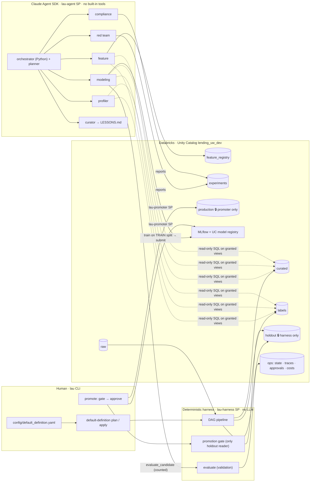
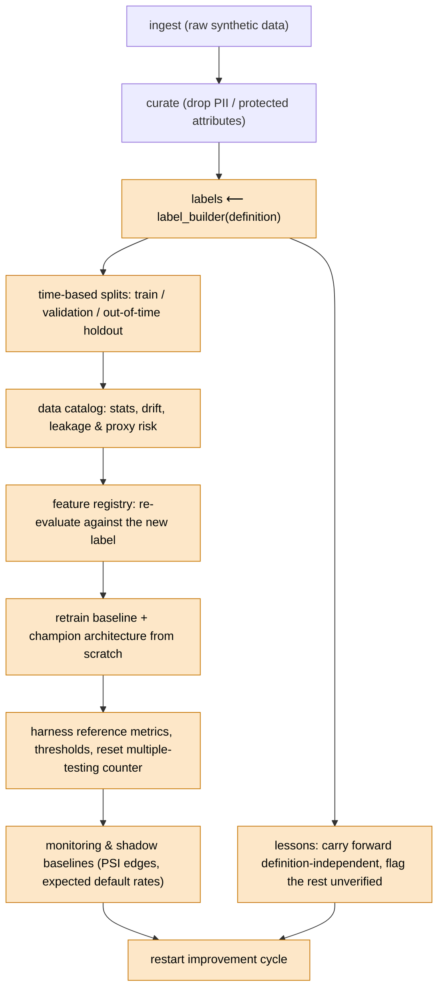
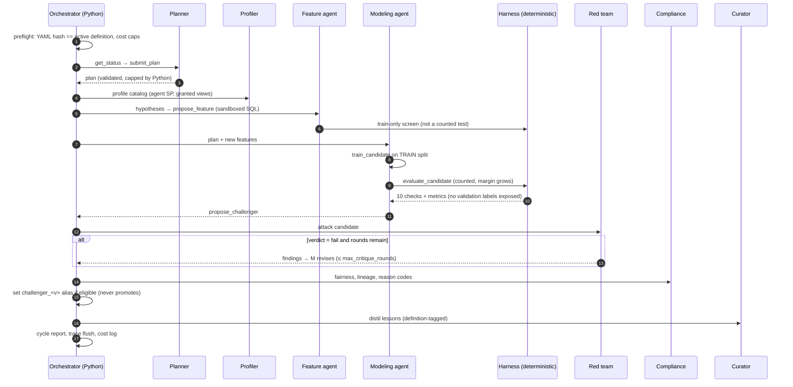
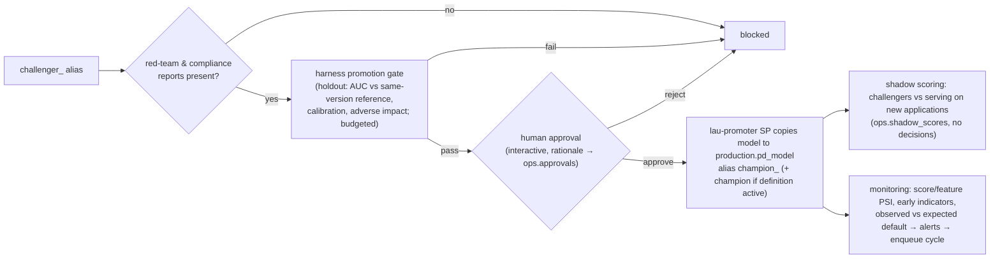
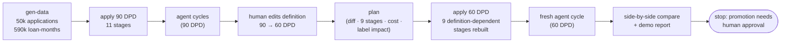

# lending-agentic-underwriting

An autonomous, agentic system that researches features, trains challenger probability-of-default (PD) models,
attacks them, and proposes underwriting improvements. It runs on **Databricks** (Unity Catalog, Delta, MLflow,
serverless SQL, Asset Bundles) with agents built on the **Claude Agent SDK**.

> **Agents propose. A deterministic evaluation harness judges. A human approves.**
>
> Agents can never grade their own work, see the out-of-time holdout, change the definition of default, or touch
> production. Every artifact is tagged with the `definition_version` that produced it.

Development uses **fully synthetic data**. This repository is engineering scaffolding for a regulated context
(ECOA/Reg B, FCRA, model risk management); it is **not** a compliance determination — see
[docs/compliance-notes.md](docs/compliance-notes.md).

**Contents:** [What it does](#what-it-does) · [Architecture](#architecture) · [How it works](#how-it-works) ·
[Running it](#running-it) · [Configuration](#configuration) · [Testing](#testing) ·
[**Demo: 90 DPD → 60 DPD on Databricks**](#demo-90-dpd--60-dpd-on-databricks) ·
[Limitations](#limitations-and-known-issues) · [Repository map](#repository-map)

---

## What it does

| Capability | How |
|---|---|
| Configurable definition of default drives everything | `config/default_definition.yaml` → validated, normalized, content-hashed → `definition_version` |
| Automatic change propagation | explicit DAG; a changed hash invalidates and rebuilds labels, splits, catalog, features, baselines, harness references, monitoring, lessons, and restarts the agent loop |
| Continuous research | planner, data profiler, feature researcher, modeler, red team, compliance reviewer and curator agents |
| Deterministic judging | harness computes AUC/KS, calibration, lift, time/segment stability, PSI, leakage, adverse impact, proxies, reason codes, and a multiple-testing-aware margin |
| Platform-enforced isolation | three service principals with Unity Catalog grants; agents cannot read the holdout, raw data, protected attributes, all-version labels or `ops` |
| Human-gated promotion | holdout gate → your recorded approval → a separate promoter identity registers the champion |
| Operations | shadow scoring, drift/outcome monitoring, cost guardrails, full audit trail, one-command teardown |
| Rich synthetic data (v2) | applications + bureau + **6 months of bank-statement transactions** per applicant, with planted cash-flow signal, leak and proxy ([docs/synthetic-data.md](docs/synthetic-data.md)) |

## Architecture



## How it works

### 1. Definition of default → `definition_version`

`config/default_definition.yaml` is the single source of truth for the target:

| Field | Example | Meaning |
|---|---|---|
| `delinquency_threshold_dpd` | 90 | 30/60/90/120/150/180 |
| `delinquency_timing` | `ever` | `ever` in window, or `end_of_window` |
| `observation_window_months` | 12 | months on book in which the event is measured |
| `min_seasoning_months`, `maturity_rule` | 12, `exclude` | immature loans excluded or kept as censored |
| `include_charge_off / bankruptcy / settlement / forbearance_as_default` | true/true/true/false | extra default events |
| `cure_handling` | `count_if_ever` | or `cured_not_default` with `cure_months_required` |
| `exclusions`, `early_payoff_within_months` | fraud, deceased, early payoff ≤ 3 m | loans removed from the population |
| `balance_materiality_threshold` | 50.0 | past-due amounts below this are ignored |
| `custom_sql_predicate` | `null` | escape hatch: a sandboxed boolean SQL expression over loan-month columns |

The definition is validated (pydantic), normalized (sorted exclusions, canonical SQL) and hashed (SHA-256 of the
semantic fields → 12 hex chars). `metadata` (name/description) is not hashed. **Label derivation is code, not
data:** `src/lau/definition/label_builder.py` is the only place "default" is computed, from raw monthly performance.
`labels_io` is the only sanctioned reader: it requires a version, refuses inactive versions (except in explicit
side-by-side comparisons), verifies row tags, and logs every read.

### 2. Invalidation DAG



Each stage has a fingerprint = hash(stage, code version, definition version if dependent, root inputs, upstream
fingerprints). A stage is fresh iff a successful run with that fingerprint exists, so an **unchanged definition
reruns nothing** and a **changed definition reruns exactly the orange stages**, in order. All outputs are
partition-replaced by `definition_version`, so versions coexist and stay queryable, which enables side-by-side
comparison of two definitions.

Safety around the change: `plan` prints the field diff, affected stages, estimated cost and label-rate impact;
`apply` needs interactive confirmation or a recorded approval for that exact hash (CI/job path). Nothing is
auto-promoted. Old champions stay in the registry tagged `superseded_by_definition_change` and keep serving until a
champion for the new definition passes the gate and a human approves. `lau status` always states what is serving
and under which definition.

### 3. Data layer and governance

| Schema | Contents | harness SP | agent SP | promoter SP |
|---|---|---|---|---|
| `raw` | applications (with synthetic PII), monthly performance, **bank transactions**, protected attributes, lineage | read | — | — |
| `curated` | applications (no PII/protected) with `cf_*` cash-flow features, `cashflow_monthly` (pre-decision only), `applications_dev` and `cashflow_monthly_dev` views (pre-holdout period), data catalog | all | **views only** | — |
| `labels` | `labels_all` (every version), splits, `labels_active` view (**active definition, train split only**) | all | **`labels_active` only** | — |
| `feature_registry` | engineered features + per-version performance | all | read/write | — |
| `experiments` | agent reports, profiler flags, candidate models | all | read/write | read |
| `holdout` | out-of-time labels per version | **only reader** | — | — |
| `production` | champion model, promotion records | read | — | **only writer** |
| `ops` | pipeline state, definition versions/approvals, evaluations, experiment counter, gate results, approvals, agent trace, cost log, cycles, alerts | all | — | read |

Grants come from a single spec (`src/lau/governance/grants.py`) that is applied as UC `GRANT`s **and** enforced
in-process by every data-access object (defense in depth; faithful offline tests). The holdout is additionally
protected by a token that only the promotion gate can mint, and has a per-definition use budget.

### 4. The evaluation harness (no LLM)

For a candidate on the **validation** split: AUC, KS, Brier, log loss, ECE, calibration slope/intercept, lift by
decile, AUC by time slice and segment (channel, product, thin-file, employment), score PSI, thin-file AUC, leakage
(timestamp-after-decision, suspicious single-feature AUC, target-derived lineage, target-like names), adverse impact
ratios by protected class on the through-the-door population, proxy detection (pooled and per protected group vs
the reference group), and adverse-action reason codes
(TreeSHAP / linear contributions). It compares only against the champion **of the same definition version**
(otherwise the version's baseline) and requires

```
AUC_candidate ≥ AUC_reference + base_margin + k · sqrt(ln(1 + n_tests))
```

where `n_tests` counts every validation evaluation under this definition version (resets on definition change).
Ten checks must all pass: improvement, calibration, time stability, segment floor, score PSI, no leakage, no
prohibited features, no proxy features, adverse impact (AIR ≥ 0.80), reason codes.

### 5. Agents

| Agent | Model | Tools (only these) | Output |
|---|---|---|---|
| planner | Opus 5.5 | `get_status`, `submit_plan` | validated cycle plan |
| profiler | Haiku 4.5 | read-only SQL, `catalog_summary`, `flag_variable`, `write_report` | profile report, advisory flags |
| feature | Sonnet 5.5 | read-only SQL, `catalog_summary`, `list_features`, `propose_feature`, `write_report` | sandboxed SQL-expression features + train-only screens |
| modeling | Sonnet 5.5 | `get_search_space`, `train_candidate`, `evaluate_candidate`, `propose_challenger`, … | candidates from a fixed template (regularized LR, LightGBM, XGBoost) |
| red team | Sonnet 5.5 | `get_evaluation`, `probe_segment`, `probe_perturbation`, `probe_adverse_selection`, `write_report` | verdict: pass / concern / fail |
| compliance | Haiku 4.5 | `get_fairness_report`, `get_reason_codes`, `get_feature_lineage`, `write_finding` | verdict: pass / concern / block |
| curator | Haiku 4.5 | `read_cycle_artifacts`, `read_lessons`, `add_lessons` | versioned `LESSONS.md` entries |

Every agent session: `tools=[]` (no Bash/Read/Write/Web), only its own `mcp__lau_<role>__*` tools,
`permission_mode="dontAsk"`, a `PreToolUse` hook that re-checks the allow-list and traces the call, no settings or
skills loaded, an empty working directory, a scrubbed environment (no Databricks or cloud credentials), and hard
caps on turns, dollars and wall-clock time. Tools run in the orchestrator process as the **agent service principal**.

#### One improvement cycle



### 6. Promotion, shadow and monitoring



Reject inference / selection bias is documented, not silently "solved": see
[docs/reject-inference.md](docs/reject-inference.md) (a strategy hook plus a controlled-approval experiment sizer).

## Running it

### Prerequisites

macOS or Linux, [uv](https://docs.astral.sh/uv/), Databricks CLI ≥ 1.18, gitleaks, and on macOS `brew install libomp`
(for LightGBM). Python 3.12 is pinned (it matches Databricks serverless environments v3–v5).

### Credentials (only in `.env`)

```bash
cp .env.example .env && chmod 600 .env
```

| Variable | For |
|---|---|
| `DATABRICKS_HOST` + `DATABRICKS_CONFIG_PROFILE` (OAuth, preferred) or `DATABRICKS_TOKEN` | you (admin) |
| `ANTHROPIC_API_KEY` (+ `ANTHROPIC_WORKSPACE_ID` if the key isn't workspace-scoped) | agent runtime |
| `LAU_{HARNESS,AGENT,PROMOTER}_CLIENT_ID/SECRET` | service principals (written by `lau init`) |

`.env` is parsed into memory and never exported to `os.environ`, so agent subprocesses never inherit Databricks
credentials. A pre-commit hook (gitleaks + a `.env` blocker) and a unit test scan for token-like strings.

### First run

```bash
make install                              # uv sync + pre-commit hooks
uv run lau check-access                   # read-only identity check
uv run lau init --dry-run                 # every catalog/schema/volume/grant/SP/warehouse action, no changes
uv run lau init                           # create them (confirmation prompt)
uv run lau gen-data                       # 50k synthetic applications + monthly performance → raw
uv run lau default-definition plan        # diff, stages, cost, label-rate impact
uv run lau default-definition apply       # activate + build everything; starts a cycle if a key is configured
uv run lau run-cycle                      # another improvement cycle
uv run lau status                         # active definition, serving model, freshness, cycles, cost
uv run lau promote <model_version>        # holdout gate → your approval → champion
make deploy                               # Asset Bundle: 4 serverless jobs, deployed PAUSED
make demo                                 # the 90 DPD → 60 DPD demo below
make teardown                             # remove everything the project created
```

### CLI reference

| Command | What it does |
|---|---|
| `lau init [--dry-run]` | catalog, schemas, landing volumes, 2X-Small warehouse, 3 SPs, grants, MLflow experiment |
| `lau check-access` | verifies each identity, then probes isolation as agent, ui and promoter (results in `ops.access_checks`) |
| `lau gen-data [--n N --seed S]` | synthetic raw data; ground truth to `.lau/ground_truth.json` (never shown to agents) |
| `lau default-definition plan [--approve]` | diff + impact; `--approve` records approval of that exact hash (for the job path) |
| `lau default-definition apply [--yes] [--no-cycle]` | activate and rebuild downstream |
| `lau default-definition compare other.yaml` | build another definition side by side and compare |
| `lau profile` / `lau run-cycle` | profiler only / full improvement cycle |
| `lau stop-cycle <cycle_id> --reason …` | ask a running cycle to stop before its next agent run (recorded as stopped_by_user) |
| `lau evaluate <mv>` | harness evaluation on validation (no holdout) |
| `lau promote <mv>` | gate → approval → promotion |
| `lau shadow` / `lau monitor` | shadow scoring / drift and outcome monitoring |
| `lau status` / `lau cost` | system status / actual DBUs from `system.billing.usage` + logged spend |
| `lau evidence run [--only step]` | benchmark ledger, definition sensitivity, vintages, cash-flow cohorts, proxy scan, registry mirror, verdict |
| `lau versions show` / `record` | version ledger for thresholds, budgets, models, benchmarks, grants, prompts and code |
| `lau console [--mirror] [--actions]` | the Underwriting Console; `--mirror` follows the workspace through the console snapshot (no warehouse while browsing); human actions only with `--actions` |
| `lau console-snapshot publish` | publish what the console may read to the `ops.console` volume (also done by jobs, cycles and the commands below) |
| `lau gate <ref>` / `lau decide <ref> --decision … --rationale …` / `lau promote-approved <ref>` | the promotion steps one at a time: holdout gate, a person's decision (two-person rule in prod), promotion |
| `lau ack-alert <id> [--note]` | acknowledge a monitoring alert |
| `lau teardown` | remove all project resources (restores an adopted warehouse) |

### Scheduled jobs (Asset Bundle, `databricks.yml`)

`lau-definition-sync` (applies a changed definition only with a recorded approval), `lau-shadow-scoring`,
`lau-daily` (definition sync, shadow scoring, monitoring, evidence and the console snapshot, in that order, waking the warehouse once a day) and `lau-improvement-cycle` (weekly; runs when `ops.cycle_queue` has work). All run on serverless compute as
the harness service principal and are deployed **paused**. Targets: `dev` (this workspace) and `prod` (placeholder).

## Underwriting Console (web UI)

A read-only web console over the same tables: what the system is doing now, what it did (a timeline of definitions,
data loads, cycles, evaluations, gates, approvals and alerts), what it will do next, and whether it is improving. The
improvement evidence comes from `lau evidence run`, which re-scores every model and the frozen legacy score on the same
loans under frozen 30, 60 and 90 DPD benchmark definitions with paired bootstrap intervals, then records a verdict. The
console reads only through a dedicated read-only role, marks agent claims apart from harness measurements, and shows
designed "not available yet" states for the parts that do not exist (real-time decision API, live loan-status feed,
staged rollouts). Human actions (holdout gate, approve, promote, stop a cycle, acknowledge an alert) are disabled
unless `lau console --actions`.

```bash
uv run python scripts/export_console_fixture.py --out .local_lake/console_fixture
```

```bash
LAU_ENV_FILE=/dev/null LAU_BACKEND=local LAU_LOCAL_LAKE=.local_lake/console_fixture uv run lau console
```

Details, architecture and tests: [docs/console/README.md](docs/console/README.md). Design: [docs/console/design-intent.md](docs/console/design-intent.md). API contract: [docs/console/contract.md](docs/console/contract.md).

## Configuration

| File | Controls |
|---|---|
| `config/project.yaml` | host, catalog, schema names, warehouse size/auto-stop, service principal names, MLflow names |
| `config/default_definition.yaml` | the definition of default (human-edited only) |
| `config/budgets.yaml` | per-cycle $ / DBU / experiments / critique rounds / wall clock, per-agent caps, monthly hard stop, holdout budget |
| `config/models.yaml` | Claude model per agent role |
| `config/thresholds.yaml` | split fractions, gate thresholds, multiple-testing parameters, leakage, fairness, monitoring |
| `config/protected_classes.yaml` | protected-class definitions and prohibited features (for counsel review) |
| `config/synth.yaml` | synthetic data size, seed, dates, drift start |
| `config/masking.yaml` | PII masking (off in dev, on when `environment=prod`) |

## Testing

```bash
make test               # 62 offline unit tests on a local DuckDB lake (no network)
make test-integration   # 16 tests against the live workspace
```

Unit tests cover the brief's definition tests (a)–(e): every field change changes the hash and invalidates exactly
the dependent stages; an unchanged definition triggers nothing; no stage reads a label not tagged with the active
version; 60 vs 90 DPD produce different labels (monotone); an old champion is never compared with a challenger from
another definition. They also cover planted-leak and proxy detection, holdout isolation, the cash-flow
anti-leakage guard (post-decision transactions never reach features), SQL sandboxes, masking,
agent lockdown, and a secret scan. Integration tests prove Unity Catalog itself denies the agent principal (the
queries bypass the in-process access checks).

---

## Demo: 90 DPD → 60 DPD on Databricks

Run on 2026-09-30 in workspace `dbc-67e8cd43-5f63` (AWS us-east-2), catalog `lending_uw_dev`, 2X-Small serverless
SQL warehouse. Reproduce with `make demo` (`scripts/demo.py`); the generated report is
`reports/demo_202609301503.md`, and per-cycle reports are under `reports/cycles/`.

### Demo flow

```mermaid
gantt
  title Wall-clock timeline (UTC, 2026-09-30)
  dateFormat HH:mm:ss
  axisFormat %H:%M
  section 90 DPD (9a8e4e5657ed)
  Build: ingest→improvement_cycle (11 stages)   :done, 14:30:30, 14:38:09
  Agent cycle cy-…1450-2e0e                     :done, 14:50:00, 682s
  Agent cycle cy-…1503-e012                     :done, 15:03:30, 361s
  section Definition change
  Apply 60 DPD: labels→improvement_cycle (9 stages) :crit, 15:10:12, 15:13:28
  section 60 DPD (57d48e7ce373)
  Agent cycle cy-…1513-3bec                     :done, 15:13:30, 15:23:50
  Side-by-side compare + report                 :done, 15:23:50, 15:24:30
```





### Synthetic data (what the agents had to find)

| Planted structure | Where | Found by |
|---|---|---|
| True signal: `bureau_score`, `dti`, `util_revolving`, `inq_6m`, `pmt_to_income` drive a monthly delinquency hazard | performance simulation | the 60 DPD challenger's top 5 features are exactly these 5 |
| Leakage: `acct_review_flag`, populated by servicing *after* the decision; lineage deliberately says "unknown" | applications | data catalog (timestamp check: 100% post-decision), planner, profiler, curator lesson |
| Protected-class proxy: `geo_affluence_idx` (ZIP composition) | applications | data catalog proxy AUC 0.752; excluded by agents |
| Time drift from 2025-01: channel mix, income +8%, bureau −10, `util_revolving` effect halves, macro shock | applications + performance | catalog drift PSI; red-team time-slice probes |
| Materiality: 4% "short payers" reach DPD buckets with < $50 past due | performance | label builder (`balance_materiality_threshold`) |
| Selection bias: legacy score approves 70%; declines have no performance | applications | red-team adverse-selection caveat; docs/reject-inference.md |
| Synthetic PII (fake SSNs starting with 9, `example.com` emails) | `raw.applications_raw` | dropped in `curated`; masking layer tests |

### Tables created in Unity Catalog

| Schema | Table | Type | Rows | Cols | Notes |
|---|---|---|---:|---:|---|
| raw | applications_raw | table | 50,000 | 156 | incl. synthetic PII |
| raw | performance | table | 590,051 | 17 | one row per loan-month; status, DPD, balances, event flags |
| raw | protected_attributes | table | 50,000 | 5 | harness-only; used for fairness tests |
| raw | field_lineage | table | 156 | 4 | source system, availability |
| raw | new_applications_raw | table | 5,000 | 144 | post-as-of applications for shadow scoring |
| curated | applications | table | 50,000 | 148 | PII + protected attributes removed |
| curated | applications_dev | **view** | 30,825 | 148 | pre-holdout period; **agent-readable** |
| curated | data_catalog | table | 282 | 24 | 141 variables × 2 definitions |
| curated | field_lineage / new_applications | table | 156 / 5,000 | 4 / 144 | |
| labels | labels_all | table | 69,982 | 12 | 34,991 loans × 2 definitions |
| labels | splits | table | 53,446 | 6 | 26,723 eligible loans × 2 |
| labels | split_meta | table | 2 | 10 | one row per definition |
| labels | labels_active | **view** | 15,664 | 8 | active definition, **train split only**; agent-readable |
| holdout | oot_labels | table | 12,462 | 5 | 6,231 OOT loans × 2; harness-only |
| feature_registry | features / feature_performance | table | 16 / 29 | 11 / 9 | 16 agent-engineered features; metrics per definition |
| experiments | reports / profiler_flags | table | 14 / 9 | 10 / 6 | agent artifacts |
| ops | pipeline_state | table | 23 | 8 | every stage run with fingerprint |
| ops | definition_versions / active_definition / definition_approvals | table | 2 / 2 / 4 | | append-only lineage of definitions |
| ops | evaluations / experiment_counter | table | 7 / 7 | | harness results; multiple-testing ledger |
| ops | harness_reference / monitoring_baseline / baselines / label_stats | table | 2 each | | per definition |
| ops | cycles / cycle_queue / agent_trace / cost_log | table | 4 / 2 / 170 / 10 | | audit trail |

Models (UC registry): `lending_uw_dev.experiments.pd_candidates` holds the baselines (v1, v6) and agent candidates
(v2–v5, v7–v9), each tagged with its `definition_version`.

### The two definitions

```diff
 metadata:
-  name: dpd90_ever_12m
+  name: dpd60_ever_12m
-delinquency_threshold_dpd: 90
+delinquency_threshold_dpd: 60
 delinquency_timing: ever
 observation_window_months: 12
 (all other fields identical)
```

| | 90 DPD | 60 DPD |
|---|---|---|
| `definition_version` | `9a8e4e5657ed` | `57d48e7ce373` |
| Approved loans | 34,991 | 34,991 |
| Excluded | unseasoned 6,656 · early payoff 1,312 · deceased 170 · fraud 130 | same |
| Eligible (uncensored) | 26,723 | 26,723 |
| Defaults | 2,549 | **3,429 (+880)** |
| Default rate | 9.54% | **12.83% (+3.29 pp)** |
| First trigger: delinquency / bankruptcy / settlement | 1,996 / 550 / 3 | 2,891 / 535 / 3 |

Eligibility is unchanged because only the threshold changed. Bankruptcy triggers *fall* slightly under 60 DPD
because a 60-day delinquency now occurs first for some loans (the trigger is the earliest event).

### Time-based splits (by origination month)

| Split | Months | Loans | Default rate (90 DPD) | Default rate (60 DPD) |
|---|---|---:|---:|---:|
| train (last months = early-stopping tail) | 2023-01 … 2024-07 | 15,664 | 8.44% | 11.64% |
| validation | 2024-08 … 2024-12 | 4,828 | 8.89% | 11.93% |
| out-of-time holdout (harness only) | 2025-01 … 2025-06 | 6,231 | 12.81% | 16.53% |

The rising OOT default rate is the planted drift (macro shock from mid-2025).

### Data catalog findings (identical flags under both definitions)

| Finding | Evidence |
|---|---|
| Leakage: `acct_review_flag` | populated after `decision_ts` for 100% of rows; single-feature AUC 0.756 (90) / 0.761 (60) — *below* the 0.85 threshold, so only the timestamp check catches it |
| Proxy: `geo_affluence_idx` | predicts protected-group membership with AUC 0.752 |
| Proxy: `zip3` | AUC 0.738 |
| Strongest clean signals (train AUC, 90 DPD) | `pmt_to_income` 0.638, `legacy_score` 0.626, `scheduled_payment` 0.620, `bureau_score` 0.616, `loan_amount` 0.613 |

### Agent cycles

| Cycle | Definition | Anthropic $ | Evaluations | Challenger | Validation | Red team | Compliance |
|---|---|---:|---:|---|---|---|---|
| `cy-202609301450-2e0e` | 90 DPD | 0.52 | 2 | v2 (LR, 12 base features) | all checks pass | concern | pass |
| `cy-202609301503-e012` | 90 DPD | 0.44 | 1 | v5 (LightGBM, 25 features incl. 6 engineered) | all checks pass | concern | concern |
| `cy-202609301513-3bec` | 60 DPD | 0.55 | 2 | v7 (LR, 11 base features) | all checks pass | concern | pass |

Per-agent effort across the demo (from `ops.agent_trace`, 170 traced tool calls):

| Agent | Tool calls | State-changing | $ |
|---|---:|---:|---:|
| planner | 10 | 3 | 0.31 |
| profiler | 44 | 11 | 0.17 |
| feature | 33 | 19 | 0.27 |
| modeling | 34 | 21 | 0.30 |
| red team | 21 | 3 | 0.16 |
| compliance | 15 | 3 | 0.11 |
| curator | 13 | 3 | 0.20 |

The planner's first goal in the first cycle, unprompted: *exclude `acct_review_flag` (post-decision leakage),
`zip3` and `geo_affluence_idx` (proxy risk).*

### Every harness evaluation (the multiple-testing ledger)

| Candidate | Definition | Val AUC | Reference AUC | Required margin | Tests so far | Passed |
|---|---|---:|---:|---:|---:|---|
| baseline v1 | 90 | 0.6726 | — | — | 0 (reference) | — |
| v2 | 90 | **0.7006** | 0.6726 | 0.0045 | 1 | ✅ |
| v3 | 90 | 0.6966 | 0.6726 | 0.0051 | 2 | ✅ |
| v5 | 90 | 0.6995 | 0.6726 | 0.0055 | 3 | ✅ |
| baseline v6 | 60 | 0.6696 | — | — | 0 (**counter reset**) | — |
| v7 | 60 | **0.6944** | 0.6696 | 0.0045 | 1 | ✅ |
| v9 | 60 | 0.6924 | 0.6696 | 0.0051 | 2 | ❌ |

The required margin rises with each test on the same validation data (0.0045 → 0.0051 → 0.0055) and resets to
0.0045 under the new definition. v7 is compared against the 60 DPD baseline, never against a 90 DPD model.

### Challengers in detail

| | v5 (90 DPD) | v7 (60 DPD) |
|---|---|---|
| Model | LightGBM, 25 inputs | regularized logistic regression, 11 inputs |
| Engineered features | `burden_x_low_score`, `burden_x_low_score_nomiss`, `log_pmt_to_income_cap`, `loan_to_income`, `bur_attr_missing_cnt8`, `burden_x_delinq_recency` | none |
| Top features | `burden_x_low_score`, `legacy_score`, `pmt_to_income`, `bureau_score`, … | `bureau_score`, `pmt_to_income`, `util_revolving`, `dti`, `inq_6m` (**the 5 planted causal features**) |
| Val AUC / ECE | 0.6995 / 0.007 | 0.6944 / 0.012 |
| Top-decile default rate (lift) | 27.9% (3.15×) | 32.9% (2.76×) |
| Min adverse impact ratio | 0.965 | 0.989 |
| Thin-file AUC | 0.653 | 0.600 |
| Score PSI train→val | 0.003 | 0.006 |
| AUC by time slice | 0.717 / 0.661 / 0.727 | 0.720 / 0.659 / 0.707 |

Red-team findings were consistent across cycles: thin-file applicants are weaker and over-predicted (risk of
over-declining them), there's an unexplained AUC dip in Oct–Nov 2024, and calibration is too extreme in the tails.
Adverse selection at a 70% approval rate was favorable (swap-in 6.9% vs swap-out 12.5% default rate for v2), with
the approved-only selection-bias caveat.

### Engineered features (from the feature agent)

| Feature | Expression (sandboxed SQL) | Train AUC 90 → 60 |
|---|---|---|
| `burden_x_low_score` | `least(pmt_to_income,1.0) * (850 - coalesce(bureau_score,600)) / 100.0` | 0.675 → 0.659 |
| `log_pmt_to_income_cap` | `ln(1 + least(greatest(pmt_to_income,0),1.0))` | 0.638 → 0.623 |
| `loan_to_income` | `least(loan_amount / nullif(annual_income,0), 2.0)` | 0.632 → 0.620 |
| `pmt_to_income_band` | policy-style bands of `pmt_to_income` | 0.632 → 0.618 |
| `util_x_burden` | `util_cap × least(pmt_to_income,1.0)` | 0.621 → 0.610 |
| `payment_to_income_x_term` *(new under 60)* | `least(greatest(pmt_to_income,0),1.0) * ln(1 + term_months)` | — → 0.623 |
| `rev_balance_to_income` *(new under 60)* | `least(coalesce(total_rev_balance,0) / nullif(annual_income,0), 3.0)` | — → 0.564 |

All 13 features registered under 90 DPD were automatically **re-evaluated against the 60 DPD label** by the
`feature_registry_eval` stage (29 performance rows = 13 × 2 + 3 new).

### What the definition change did, stage by stage

| Stage | 90 DPD build | 60 DPD rebuild | Result under 60 DPD |
|---|---|---|---|
| ingest, curate | ran | **fresh (skipped)** | raw/curated data are definition-independent |
| labels | 18.6 s | 15.0 s | +880 defaults; change vs 90 logged to `ops.label_stats` |
| lessons | ✓ | ✓ | 7 definition-independent lessons carried forward; 10 flagged `unverified-under-57d48e7c` |
| splits | ✓ | 20.1 s | same months; new default rates; new `holdout.oot_labels` partition; views re-pointed |
| catalog | ✓ | ✓ | per-variable stats and leakage re-computed against the new label |
| feature_registry_eval | ✓ | ✓ | 13 features re-scored |
| baseline_retrain | 53.8 s | 58.4 s | new LR baseline v6 |
| harness_reference | 34.4 s | 34.1 s | reference AUC 0.6696; multiple-testing counter reset |
| monitoring_baseline | ✓ | ✓ | new PSI edges and expected default rates |
| improvement_cycle | ✓ | ✓ | fresh cycle `cy-…1513-3bec` |

Running `apply` again with an unchanged file is a no-op ("definition unchanged and all stages fresh").

### Isolation verified on the live workspace (`make test-integration`)

| Query as `lau-agent` (bypassing in-process checks) | Unity Catalog result |
|---|---|
| `holdout.oot_labels` | ❌ INSUFFICIENT_PERMISSIONS |
| `labels.labels_all` | ❌ INSUFFICIENT_PERMISSIONS |
| `raw.protected_attributes`, `raw.performance` | ❌ INSUFFICIENT_PERMISSIONS |
| `curated.applications` (base table) | ❌ INSUFFICIENT_PERMISSIONS |
| `ops.pipeline_state`, `ops.active_definition` | ❌ INSUFFICIENT_PERMISSIONS |
| `CREATE TABLE production.*` | ❌ INSUFFICIENT_PERMISSIONS |
| `labels.labels_active` | ✅ 15,664 rows, split = `train` only |
| `curated.applications_dev`, `curated.data_catalog` | ✅ |
| `holdout.oot_labels` as `lau-promoter` / as `lau-harness` | ❌ / ✅ |

### Cost

Prices (current list, checked 2026-09-30): Databricks SQL Serverless on AWS Premium, US regions, is
**$0.70 per DBU**, cloud compute included ([Flexera, Feb 2026](https://www.flexera.com/blog/finops/databricks-pricing-guide/)).
A **2X-Small** serverless SQL warehouse consumes **4 DBU/hour**
([Databricks serverless DBU table](https://learn.microsoft.com/en-us/azure/databricks/resources/pricing)), so it
costs **$2.80 per running hour** (about $0.047 per minute). These match `config/project.yaml`.

| Activity | Warehouse busy time | $ at $0.70/DBU | Anthropic $ (actual) |
|---|---:|---:|---:|
| Apply 90 DPD (11 stages) | 0.081 DBU | $0.06 | — |
| Cycle `cy-…1439-332a` (Anthropic header error, no work) | 0.010 DBU | $0.01 | $0.00 |
| Cycle `cy-…1450-2e0e` (90 DPD) | 0.203 DBU | $0.14 | $0.52 |
| Demo cycle `cy-…1503-e012` (90 DPD) | 0.075 DBU | $0.05 | $0.44 |
| Demo apply 60 DPD (9 stages) | 0.115 DBU | $0.08 | — |
| Demo cycle `cy-…1513-3bec` (60 DPD) | 0.113 DBU | $0.08 | $0.55 |
| **Total** | **0.60 DBU** | **$0.42** | **$1.51** |

Busy time is a **lower bound**. A serverless warehouse bills while running, including idle time between queries
(agents think between tool calls) and the 5-minute auto-stop tail. Wall-clock uptime from 14:30 to 15:29 UTC was two
sessions of about 15 and 40 minutes, so the **upper bound is about 3.6 DBU ≈ $2.54**. Setup and debugging queries
before 14:30 are not included. **Databricks spend for this demo is therefore between $0.42 and $2.54, plus $1.51 of
Anthropic spend: at most about $4.05 in total.**

Billed actuals are not available yet: `system.billing.usage` and `system.billing.list_prices` were still empty in
this new account at the time of writing (Databricks fills system tables with a delay). `lau cost` will report billed
DBUs and dollars from those tables once they populate.

The per-cycle caps are $10 Anthropic, 5 DBU (≈ $3.50), 20 evaluations and 60 minutes, with a $100 monthly hard stop.

> Metering fix made while writing this: the per-process busy-time counter was not reset between log entries, so the
> original `ops.cost_log` rows double-counted (sum 2.86 DBU). `cost.metered_warehouse_usd()` now consumes the counter;
> the table above is reconstructed from those rows.

### What the demo did *not* do

- **Promote anything.** No model is serving; the legacy policy remains in effect. `lau promote 7` would run the
  holdout gate and ask for your approval. Because nothing was promoted, the demo could not show an old champion being
  tagged `superseded_by_definition_change`; that path is covered by unit test (e).
- **Run the scheduled jobs.** They are deployed and paused.

## Limitations and known issues

- **Human admin is not isolated.** As catalog owner and workspace admin you can grant yourself holdout access;
  isolation is between the system's identities. Production should move ownership to a group with change control.
- **One-person approvals.** The same person owns the catalog, edits the definition and approves promotions
  (segregation of duties is an item for compliance).
- **Reject inference is not solved** (documented hook and experiment sizer only).
- **Cure rule:** `cure_handling: cured_not_default` is a stub pending a policy decision (`TODO(human)` in
  `src/lau/definition/label_builder.py`; its unit test fails until implemented).
- **Multiple-testing margin** is a pragmatic heuristic, not an exact correction (see design decisions).
- The first cycle in `ops.cycles` (`cy-…1439-332a`) hit an Anthropic workspace-header error and did nothing; it
  predates the fix that marks such cycles `failed_agent_api`.
- The scheduled improvement-cycle job needs a Databricks secret scope `lau` (not created automatically).
- Admin access uses a short-lived personal access token during remote setup; switch to OAuth
  (`databricks auth login`) and revoke the token.

Design rationale: [docs/design-decisions.md](docs/design-decisions.md) · governance:
[docs/governance.md](docs/governance.md) · cost: [docs/cost.md](docs/cost.md) · compliance:
[docs/compliance-notes.md](docs/compliance-notes.md) · selection bias: [docs/reject-inference.md](docs/reject-inference.md)

## Repository map

```
config/                 project, default_definition, definitions/ (90 & 60 DPD), budgets, models, thresholds,
                        protected_classes, synth, masking
src/lau/settings.py     typed config + generated workspace state (.lau/, gitignored)
src/lau/credentials.py  .env-only credentials, per-role SDK configs, scrubbed agent env
src/lau/store.py        one data API over Databricks (SQL warehouse + UC volumes) and local DuckDB; ACL
src/lau/definition/     schema, hashing, sql_predicate sandbox, label_builder, labels_io, registry
src/lau/pipeline/       DAG engine, stages, plan/apply/compare
src/lau/data/           splits, features, feature registry, data catalog
src/lau/harness/        metrics, leakage, fairness, reason codes, multiple testing, holdout, gate, evaluate
src/lau/modeling/       PDModel template, search space, training, MLflow/UC registry I/O
src/lau/agents/         runner (SDK isolation), orchestrator, prompts/, tools/, lessons
src/lau/promotion/      promote, shadow, monitor, reject_inference
src/lau/governance/     grants spec, UC layout, service principals, teardown
src/lau/cli.py, jobs.py `lau` CLI and `lau-job` entry point for Databricks jobs
databricks.yml, resources/jobs.yml   Asset Bundle (dev/prod), paused serverless jobs
scripts/demo.py         the demo above
tests/unit, tests/integration        offline tests; live-workspace isolation tests
docs/                   design decisions, governance, cost, compliance notes, reject inference
LESSONS.md              curator-maintained, definition-tagged lessons
reports/                cycle reports and demo reports (gitignored cycle folders)
```
