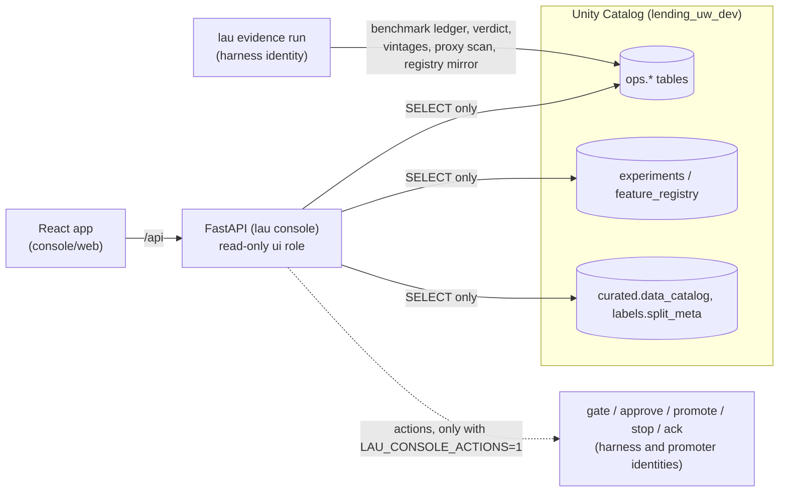

# Underwriting Console

A web console that shows what the system is doing, what it has done, what it will do next, and whether it is
getting better. It is read-only by default. The human decisions it supports (run the holdout gate, approve or reject,
promote, stop a cycle, acknowledge an alert) are off unless explicitly enabled, and they run through the same code
paths as the CLI.

- Product design: [design-intent.md](design-intent.md) (the approved proposal: twenty screens, evidence rules).
- API and data contract: [contract.md](contract.md) (every endpoint, the tables it reads, the new evidence tables).
- Front-end rules: [../../console/web/CONVENTIONS.md](../../console/web/CONVENTIONS.md).

## How it fits together



- **Read path.** Every read goes through `get_store("ui")`, a role whose grants allow `ops`, `experiments`,
  `feature_registry` and `production`, plus three metadata tables. It cannot read applicant rows, all-version labels or
  the holdout (`tests/unit/test_console_api.py::test_ui_role_cannot_read_applicant_level_data`). Anything that needs
  those is precomputed as aggregates by the evidence job.
- **Evidence job.** `lau evidence run` re-scores every registered model plus the frozen legacy score under the same
  frozen benchmark definitions (`config/benchmarks.yaml`), with paired bootstrap intervals, and writes the verdict
  (improved, no change, not the best available, regressed, not enough evidence). It also writes definition
  sensitivity, vintage curves, cash-flow cohorts, the proxy scan, a registry mirror and flattened metrics. The console
  never calls MLflow and never computes a metric itself.
- **Backend.** `src/lau/console/`: `services/` derive screen data from tables; `routers/` map one module per screen
  group to the contract; `util.py` handles safe reads, JSON conversion (never NaN) and a short TTL cache.
- **Front end.** `console/web/`: React 19, TypeScript, Vite, TanStack Query, Recharts. All twenty screens of the
  design (30 routes) plus the Ask drawer. `src/api/types.ts` is the contract; pages use only the hooks in
  `src/api/hooks.ts`; each screen's components live in `src/components/<Screen>/`. Every route was checked on the
  real-data fixture at desktop width and at 400 px (no page-level horizontal scroll, no console errors).
- **Ask.** `POST /api/ask` runs a read-only Claude agent (`lau.console.ask`) with two tools, `describe_tables` and
  `sql_query`, both over the ui role. It gets the same isolation as the cycle agents: no built-in tools, dontAsk
  permissions, a scrubbed environment, and caps of $0.25, 8 turns and 3 minutes. Row-level shadow scores are readable
  only in aggregate. Every question is traced and costed.

## Run it

Offline, on a copy of the real tables (no Databricks connection, no credentials needed):

```bash
uv run python scripts/export_console_fixture.py --out .local_lake/console_fixture
```

```bash
LAU_ENV_FILE=/dev/null LAU_BACKEND=local LAU_LOCAL_LAKE=.local_lake/console_fixture uv run lau console
```

Then open http://127.0.0.1:8765 after building the front end once:

```bash
cd console/web && npm install && npm run build
```

For front-end development, run Vite with hot reload next to the API (it proxies `/api` to port 8765):

```bash
cd console/web && npm run dev
```

Against Databricks directly, the console reads as the `lau-ui` service principal. That principal does not exist yet:
creating it (`lau init`) is a workspace change that needs approval. Until then every endpoint answers 503 with that
explanation, so use the fixture above. Refresh the fixture after new evidence:

```bash
uv run lau evidence run
```

```bash
uv run python scripts/export_console_fixture.py --out .local_lake/console_fixture
```

Enable human actions (local development only; every action is recorded with the requesting user):

```bash
uv run lau console --actions
```

To build the live-activity screen without running a real cycle, plant one in a local copy of the fixture:

```bash
uv run python scripts/console_plant_live_cycle.py --lake .local_lake/console_fixture
```

## Keep the evidence current

The evidence tables are append-per-run: every run adds rows under a new `run_id`, screens show the latest run, and the
history powers the "over time" views. Run `lau evidence run` after each cycle, definition change, data load or
promotion (it takes about three minutes on the 2X-Small warehouse and costs a few cents). The bundle declares a
daily `lau-evidence` job for it (`resources/jobs.yml`), deployed paused like the other jobs.

## Tests

```bash
uv run pytest tests/unit/test_console_api.py tests/unit/test_evidence.py -q
```

```bash
cd console/web && npm run check
```

The API tests build the app over the synthetic test lake, run the evidence job, plant a live cycle and an alert, and
check every endpoint's shape, NaN-free JSON, pagination, the alert-id contract, action gating (403 when disabled),
stop and acknowledge (when enabled), the ui role's read limits, and the ask guards.

## Not built yet (shown as designed "not available" states)

The real-time decision API, the live loan-status feed, staged rollouts, notifications and production evidence. The
matching endpoints return `{available: false, reason, requires}` so the screens explain what is missing instead of
showing invented numbers. Deploying the console as a Databricks App needs the `lau-ui` service principal
(`lau init`) and an app compute resource. Both are workspace changes that need approval first.
